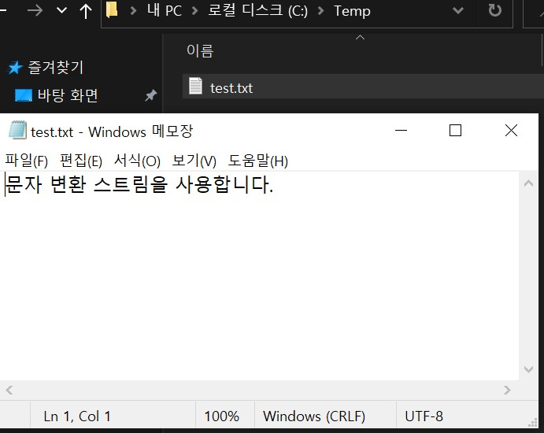
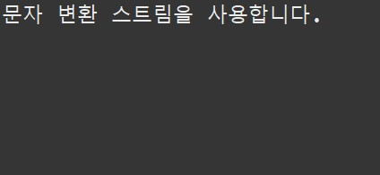

# **Project - File Input/Output**  📁

 ## 💡 `Java` PROJECT 


---

### 🧾 프로젝트 소개 

---

>**ECLIPSE 환경 구축**

> 1. ECLIPSE 설치
> 2. JDK 설치

---


### ◾ 파일 입 · 출력

<br>

#### ◾ 파일 입력(파일 저장)



<br>

#### ◾ 파일 출력(콘솔 출력)



---

```
rest time :D

◾ 간단한 파일 입·출력 해보기

<보조스트림 활용>
────────────────────────────────────
OutputStream | FileOutputStream 사용
Writer | OutputStreamWriter 사용
- write(), flush(), close()
────────────────────────────────────
InputStream | FileInputStream 사용
Reader | InputStreamReader 사용
────────────────────────────────────

◾ 함수형으로 파일 입·출력 분리
char타입 변환 과정 없애기
────────────────────────────────────
BufferedReader 사용
[Reader에 BufferedReader연결]
- readLine() 
────────────────────────────────────
```


